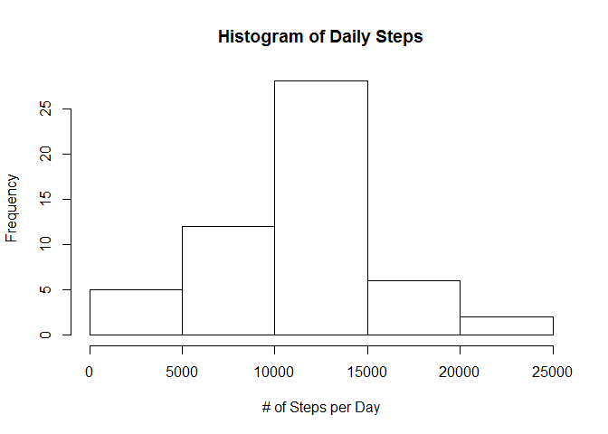
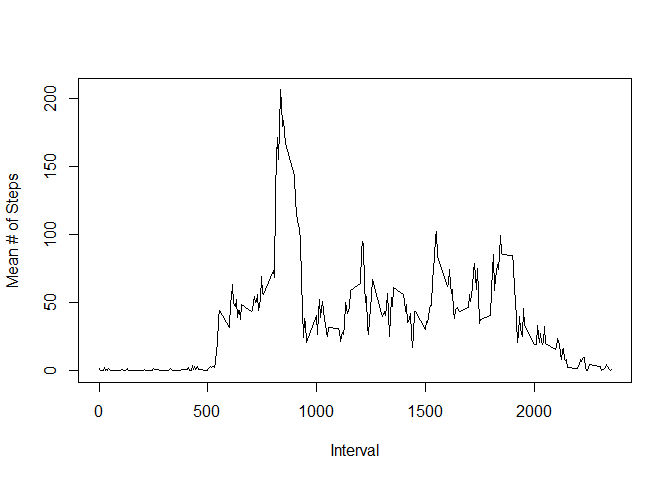
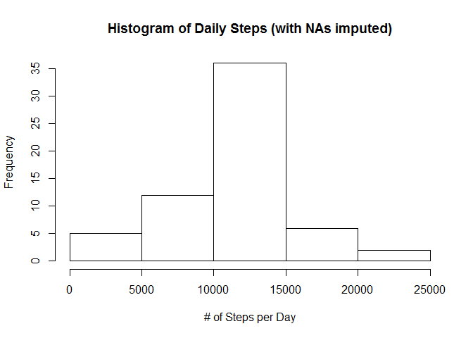
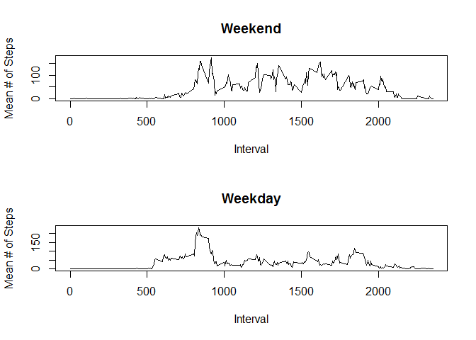

# Reproducible Research: Peer Assessment 1


## Loading and preprocessing the data
Extract the data from the zipped file and load it as a dataframe, and view data.

```r
unzip("activity.zip", exdir="./data")
df <- read.csv("./data/activity.csv")
head(df)
```

```
##   steps       date interval
## 1    NA 2012-10-01        0
## 2    NA 2012-10-01        5
## 3    NA 2012-10-01       10
## 4    NA 2012-10-01       15
## 5    NA 2012-10-01       20
## 6    NA 2012-10-01       25
```

Create a new column of the dataframe which is a date-and-time in a native R format.

```r
df$minutes <- df$interval %% 100
df$hours <- (df$interval - df$minutes)/100
df$date_and_time <- strptime(paste(df$date, df$hours, df$minutes),
                             format="%Y-%m-%d %H %M", tz="GMT")
```

Finally we can check the start and finish date for the logging, and that we have continuous records (even though some are recorded as NA):

```r
summary(df$date_and_time)
```

```
##                  Min.               1st Qu.                Median 
## "2012-10-01 00:00:00" "2012-10-16 05:58:45" "2012-10-31 11:57:30" 
##                  Mean               3rd Qu.                  Max. 
## "2012-10-31 11:57:30" "2012-11-15 17:56:15" "2012-11-30 23:55:00"
```

```r
summary(as.numeric(diff(df$date_and_time)))
```

```
##    Min. 1st Qu.  Median    Mean 3rd Qu.    Max. 
##       5       5       5       5       5       5
```

## What is mean total number of steps taken per day?
Aggregate the daily totals of steps. Note some days are not represented in this total as some entire days have NA steps.

```r
dailyTotals <- aggregate(steps ~ date, df, FUN = sum)
head(dailyTotals)
```

```
##         date steps
## 1 2012-10-02   126
## 2 2012-10-03 11352
## 3 2012-10-04 12116
## 4 2012-10-05 13294
## 5 2012-10-06 15420
## 6 2012-10-07 11015
```

A histogram of the total number of steps taken each day:

```r
hist(dailyTotals$steps, xlab="# of Steps per Day", main="Histogram of Daily Steps")
```

 

The mean and median of the number of steps per day are:

```r
mean(dailyTotals$steps)
```

```
## [1] 10766
```

```r
median(dailyTotals$steps)
```

```
## [1] 10765
```


## What is the average daily activity pattern?
Aggregate each of the time-steps into an average value for that time-step across all days, and plot the result.

```r
intervalMeans <- aggregate(steps ~ interval, df, FUN = mean)
head(intervalMeans)
```

```
##   interval   steps
## 1        0 1.71698
## 2        5 0.33962
## 3       10 0.13208
## 4       15 0.15094
## 5       20 0.07547
## 6       25 2.09434
```

```r
plot(intervalMeans$interval, intervalMeans$steps, type="l", xlab="Interval", ylab="Mean # of Steps")
```

 

The interval number which has on average the most steps is:

```r
intervalMeans[intervalMeans$steps == max(intervalMeans$steps), 'interval']
```

```
## [1] 835
```
i.e. from 08:25 till 08:30 in the morning, assuming intervals are labelled with their end time.

## Imputing missing values
The total number of intervals with missing data is:

```r
sum(is.na(df$steps))
```

```
## [1] 2304
```
Representing the following fraction of all of the data:

```r
sum(is.na(df$steps))/length(df$steps)
```

```
## [1] 0.1311
```

I am imputing missing values based on the mean for that 5-minute interval (this was chosen in preference to the average for the day as some days have no recorded data). Save this in a new column which includes the original steps data and the filled in data.

```r
df$steps_filled <- apply(df[,c('steps', 'interval')], 1, function(x) { ifelse(is.na(x[1]),
                        intervalMeans[intervalMeans$interval == x[2], 'steps'], x[1]) } )
```

Here is a histogram of the daily totals used including the imputed values (NB: all days are now represented, unlike the original histogram).

```r
dailyTotalsFilled <- aggregate(steps_filled ~ date, df, FUN = sum)
hist(dailyTotalsFilled$steps_filled, xlab="# of Steps per Day", main="Histogram of Daily Steps (with NAs imputed)")
```

 

The mean is unchanged, but including the imputed data has slightly increased the median value:

```r
mean(dailyTotalsFilled$steps_filled)
```

```
## [1] 10766
```

```r
median(dailyTotalsFilled$steps_filled)
```

```
## [1] 10766
```

## Are there differences in activity patterns between weekdays and weekends?

```r
df$dayOfWeek <- weekdays(df$date_and_time)
df <- transform(df, dayType = ifelse(dayOfWeek %in% c("Saturday", "Sunday"), "weekend", "weekday"))
intervalMeans$weekDaySteps <- aggregate(steps ~ interval, df[df$dayType=="weekday", ], FUN = mean)$steps
intervalMeans$weekEndSteps <- aggregate(steps ~ interval, df[df$dayType=="weekend", ], FUN = mean)$steps
par(mfrow=c(2,1))
plot(intervalMeans$interval,intervalMeans$weekEndSteps, main="Weekend", type="l", xlab="Interval", ylab="Mean # of Steps")
plot(intervalMeans$interval,intervalMeans$weekDaySteps, main="Weekday", type="l", xlab="Interval", ylab="Mean # of Steps")
```

 

As can be seen from the plot above, on the weekend there is much more activity throughout the day, whereas on a weekday there are a large number of steps in the morning (perhaps as part of a comute), but then a lower level of activity for the rest of the day.
